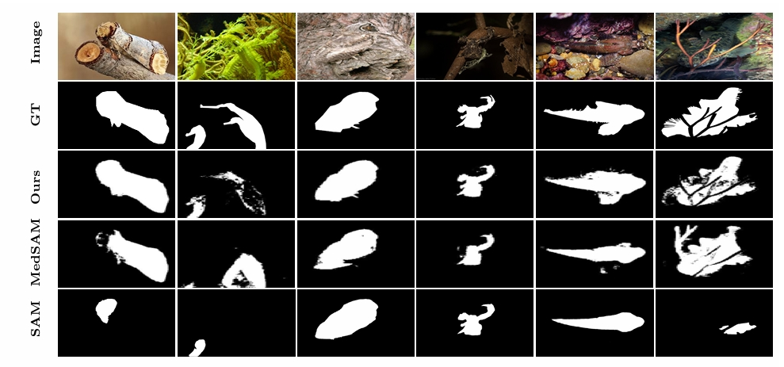

<div align="center">
<h2>COMPrompter: Rethink SAM in Camouflaged Object Detection with Multi-Prompt Network</h2>
Xiaoqin Zhang, Zhenni Yu, Li Zhao, Deng-Ping Fan, Guobao Xiao*
2024
</div>



## Usage 

### Installation

```bash
git clone https://github.com/guobaoxiao/COMPrompter
cd COMPrompter
```
## From datasets to npz 
For the train npz and test npz of the perfect boundary with gradient (corresponding Ours in Tab. 1).
You can load down the COD datasets and run to make npz one by one.

- **COD datasets**:
    download the COD datasets set from [here](https://github.com/lartpang/awesome-segmentation-saliency-dataset#camouflaged-object-detection-cod)(CAMO, CHAMELEON, COD10K, NC4K), and put into 'data/'
```bash
python pre_npz.py
```
For the test npz of the generated boundary with gradient (corresponding Ours* in Tab. 1). You should load down the dataset of the generated boundary and run to make npz one by one.
- **the generated boundary image dataset**:链接：https://pan.baidu.com/s/14b9LYOYaTQ0CQ7qukbWLtg 提取码：vmlp
```bash
python pre_npz_UEDG.py
```

### Weights
- **pre-weigth**:
    download the weight of sam from [here](https://dl.fbaipublicfiles.com/segment_anything/sam_vit_b_01ec64.pth), put into 'work_dir_cod/SAM/'

- **COMPrompter**:
    download the weight of well-trained COMPrompter, put into 'work_dir_cod/COMPrompter'
  - 链接：https://pan.baidu.com/s/1Hr7q7x3bctnEtdS7XeciUw 
    提取码：dv67


### The predicted image
- **COMPrompter using the perfect boundary**: 
  -   链接：https://pan.baidu.com/s/1MQDx1bVKoYCPFSiFV9XVew 
      提取码：u9cj

- **COMPrompter using the generated boundary**:
  - 链接：https://pan.baidu.com/s/1ezx5cl2T4hCe2O55I8Dygw 
    提取码：l051

### Train
```bash
python Train.py
```

### Test

```bash
python Inference.py
```

### Translate npz to img

```bash
python transformer_nzp_2_gt.py
```

### eval

```bash
python MSCAF_COD_evaluation/evaluation.py
```

[//]: # (## Citation)

[//]: # ()
[//]: # (If you find this project useful, please consider citing:)

[//]: # ()
[//]: # (```bibtex)

[//]: # (xxxx)

[//]: # (```)
@article{zhang2024COMPrompter,
  title={COMPrompter: Rethink SAM in Camouflaged Object Detection with Multi-Prompt Network},
  author={Zhang, Xiaoqin and Yu, Zhenni and Zhao,  Li and Fan, Deng-Ping and Xiao, Guobao},
  journal={SCIENCE CHINA Information Sciences (SCIS)},
  volume={1},
  pages={1--14},
  year={2024}
  </h2>

}
